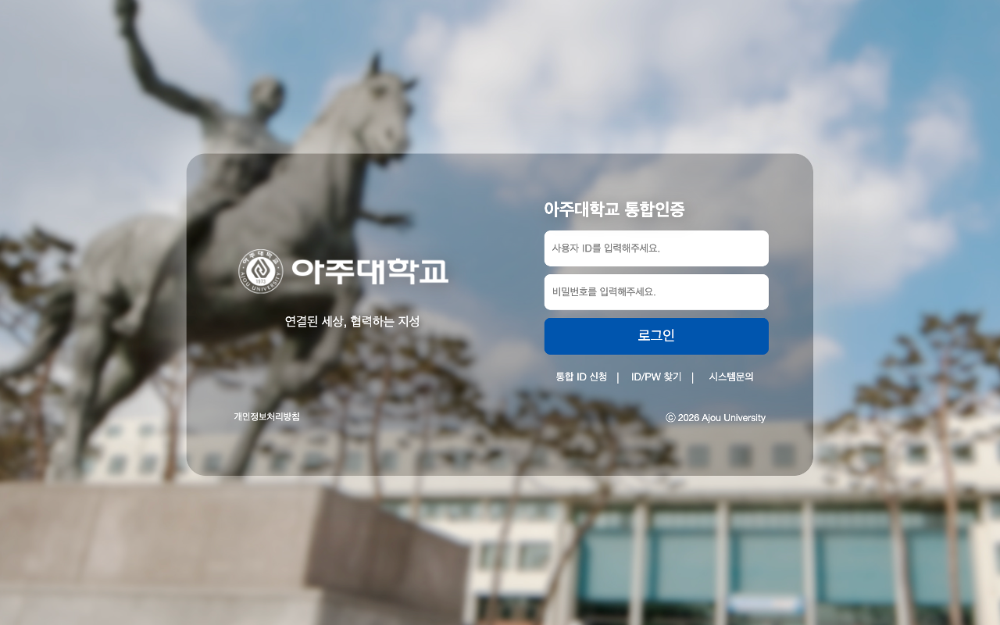

# Modern Ajou SSO Theme
<a href="https://chromewebstore.google.com/detail/icelkcckfhcdflcbnjceoociplajlhbc">

 

</a>

>
> Substitute old Ajou University login page with modern theme.
> 

## Screenshot

The extension detects url which starts with sso.ajou.ac.kr. If it starts, theme application code will insert to html.
Theme application code are reveal under repo.
- https://github.com/hyeonseungkang/ajou-sso-theme .

## For Safari or other browser users

Script for [Tampermonkey](https://www.tampermonkey.net) or [Userscripts](https://apps.apple.com/kr/app/userscripts/id1463298887) is on this repo. Script has same code and functions with extension.

[tampermonkey-ajou-sso-theme.user.js](tampermonkey-ajou-sso-theme.user.js)

## Disclaimer

This extension do not collect or send any data. Inserted codes are only replacing assets in html or applying css.

Feel free make any issues.

- Developer Hyeonseung Kang\<강 현승, hyeonseungkang@outlook.com\>
  - 아주대학교 경영인텔리전스학과
  - MIS, Ajou University
